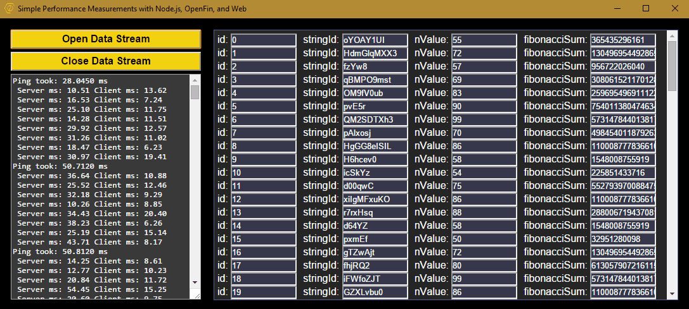
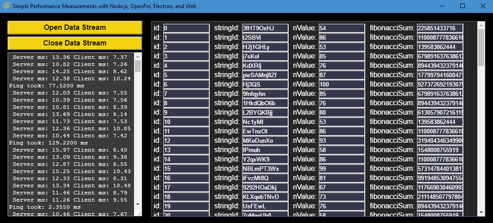
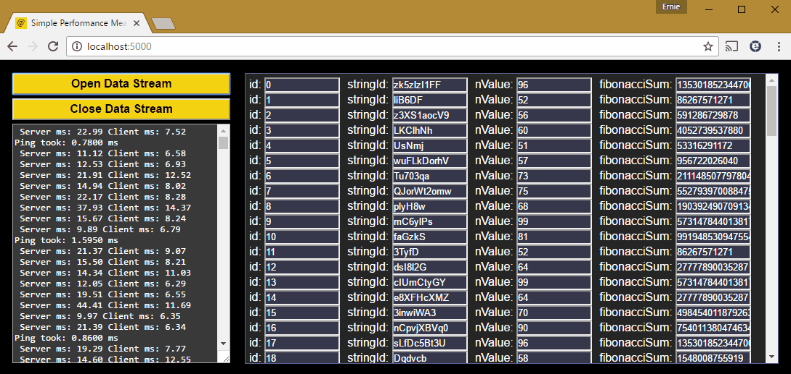

# Performance Measurements in Node.js, OpenFin, Electron, and Web
This project is intended to demonstrate the ability of a single node.js server with a single code-based to run in OpenFin and Electron desktop applications as well as any modern web browser simultaneously.

The OpenFin RVM (the ability to dynamically build the installation package via URL) is currently only available for the Windows OS but the company promises to release Mac and Linux versions in the near future.  But if you wish to run in those OSs you can manually launch following these instructions: <a target="_blank" href="https://github.com/openfin/openfin-cli">OpenFin CLI for Windows, Mac, and Linux</a>

The Electron version will compile and run based on the OS you are running this project in.  It has been tested with in Windows 10, Mac OS X, and Ubuntu Desktop 16 LTS.

More detailed breakdowns of different parts of the code can be read here:

* <a href="http://www.eikospartners.com/blog/measuring-application-performance-nodejs-web-openfin" target="_blank">Measuring application performance in Node.js, Web and OpenFin</a>
* <a href="http://www.eikospartners.com/blog/electron-create-a-single-app-for-windows-linux-and-mac" target="_blank">Electron: Create a single app for Windows, Linux, and Mac</a>

Application screenshots:

<div style="text-align: center;">
    <h2>OpenFin</h2>
    <a href="public/images/OpenFinScreeny.gif" target="_blank">
        
    </a>
    <h2>Electron</h2>
    <a href="public/images/ElectronScreeny.gif" target="_blank">
        
    </a>
    <h2>Web Browser</h2>
    <a href="public/images/WebScreeny.gif" target="_blank">
        
    </a>    
</div>

The project itself performs basic time calculations measuring client, server, and network latencies.  A data stream is opened by the client via web-sockets upon which the server sends updates at regular intervals.  The updates on the server and the client are both intentionally time consuming so as to generate viable measurements (milliseconds). 

Since they are running inside chromium-based OpenFin and Electron APIs they can be written using pure HTML5.  And because it is JavaScript and CSS the code can also be ran in any modern web browser achieving greater than 99% reuse.

This was built in Visual Studio Code but can be ran like any other node project.  It is using node.js version 6 and the client requires support for Web Workers and the performance.now() function.  To start remember to first run 

`npm install` 

to get needed dependencies and then 

`npm start`

to start the server.  If running in VS Code the launch.json file is already configure so simply press F5.

Once started, it will create an HTTP and WebSocket server listening on port:

```javascript
//Port settings
const webPort = 5000;
```

To test electron in development without having to build the installation package run:

`npm run electron`

To test the openfin in development via the CLI (note this will still perform an installation) run:

`npm run openfin`

For OpenFin and Electron installation packages, navigate to `http://localhost:5000/install`, click the Download buttons and follow the instructions to complete installation.  For electron it can take a minute or so to build the package once started but the browser will prompt for download when ready.  

For the web version, simply navigate to `http://localhost:5000/`.  This will show the same single page seen in the desktop versions.

In any application click the Open Data Stream button to begin generating time measurements.

Additional resources:

* <a href="https://www.eikospartners.com/" target="_blank">Eikos Partners Homepage</a>
* <a href="https://openfin.co/" target="_blank">OpenFin Homepage</a>
* <a href="https://openfin.co/developers/documentation-2/" target="_blank">OpenFin Developers Documentation</a>
* <a href="http://electron.atom.io/" target="_blank">Electron Homepage</a>
* <a href="http://electron.atom.io/docs/" target="_blank">Electron Developers Documentation</a>
